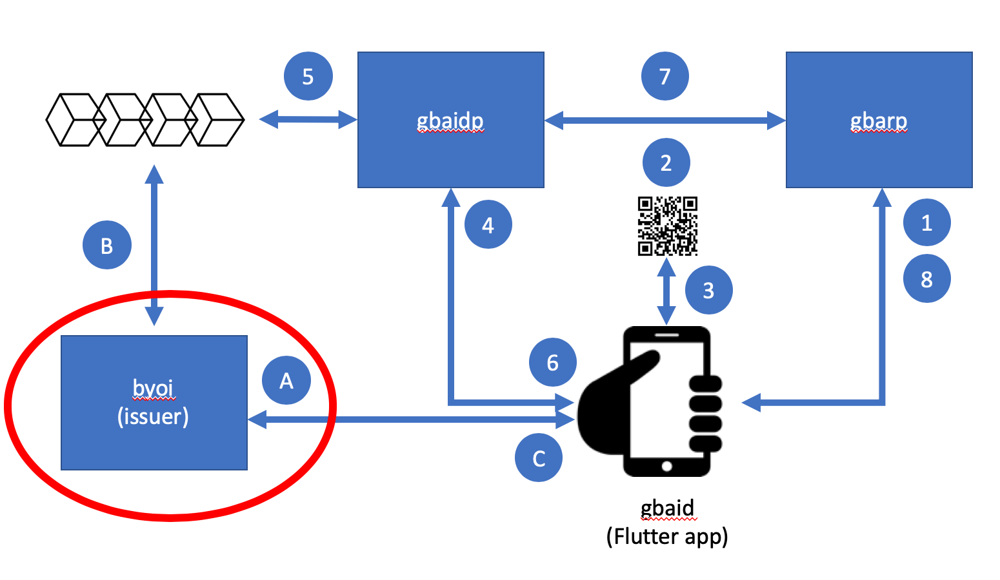

# byoi

Bring Your Own Identity (byoi) is a web application that manages a
marketplace of credential issuers such that clients can purchase W3C
Verifiable Credentials from several listed organizations and store the
issued credentials in their mobile wallet app
([gbaid](https://https://github.com/Veridium/gbaid)).  Holders can
then use a wallet credential to log into a relying party
([gbarp](https://github.com/Veridium/gbarp)) via an OIDC identity
provider ([gbaidp](https://github.com/Veridium/gbaidp)) that
authenticates the holder's credentials without requiring prior
enrollment.

The four parts of this demo includes:

* Credential issuer (byoi - this repo)
* Credential wallet (gbaid - a Flutter mobile app)
* A sample relying party (gbarp)
* An OIDC IdP that accepts (gbaidp)

The notional workflow is shown in th ediagram above: (A) a holder
selects an issuer from the marketplace in their mobile app, provides
enrollment information (e.g., email) and purchases their credentials;
(B) a DID Document is created and written to the issuers registry (via
a Universal Registrar); (C) the W3C Verifiable Credential is provided
to the holder's wallet.  After issuance, the holder can browse to a
relying party (1) that will redirect them to an IdP and presents a QR
code (2).  The holder opens the credential on their mobile device and
scans the QR code (3).  The QR code allows the mobile device to submit
the W3C Verifiable Credentials to the Idp (4) where it is verified (5)
by fetching the DID Document (via a Universal Resolver) and performing
required proofs and authentication.  If successful, the holder is
redirected via an OIDC authorization flow back to the relying party
(6, 7) and access is authorized depending on scoped attributes in the
credential.

